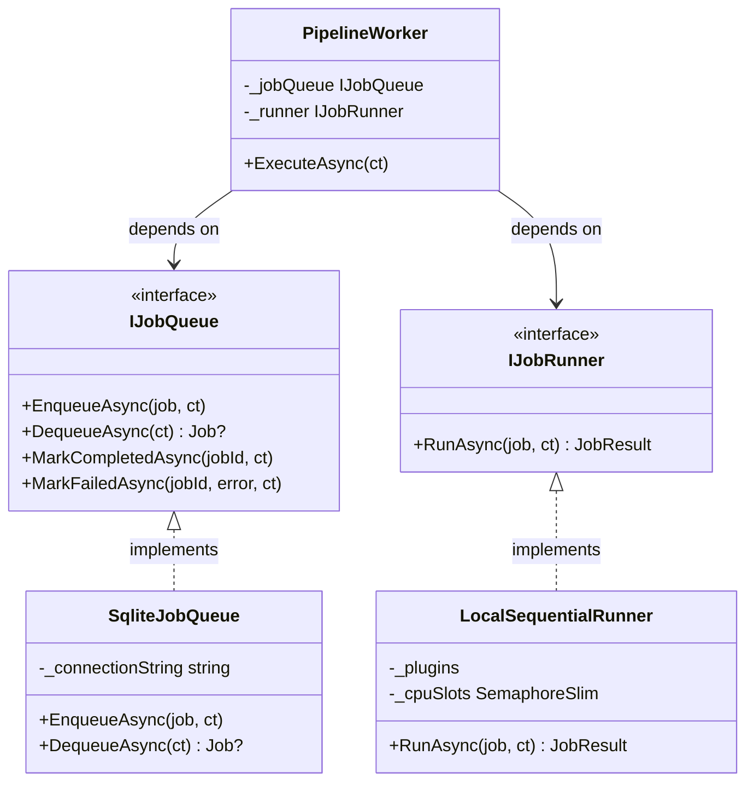

# L001 — Interfaces: why everything important has one

> Lesson 001 | 2026-05-03 | Git: `a96b94c`
> Tracks: csharp, arch
> Requires: none

---

## You open the file and see...

`src/PiKoRe.Core/Pipeline/PipelineWorker.cs` @ `a96b94c`

```csharp
public sealed class PipelineWorker : BackgroundService
{
    private readonly IJobQueue _jobQueue;
    private readonly IJobRunner _runner;

    public PipelineWorker(IJobQueue jobQueue, IJobRunner runner, ILogger logger)
    {
        _jobQueue = jobQueue;
        _runner   = runner;
        // ...
    }
```

`PipelineWorker` is the heart of the pipeline. It dequeues jobs and runs them.

But look at the types it depends on: `IJobQueue` and `IJobRunner`. Not `SqliteJobQueue`. Not `LocalSequentialRunner`. Just the `I`-prefixed names.

Open any file in `src/PiKoRe.Core/Abstractions/` and you'll find definitions like this:

`src/PiKoRe.Core/Abstractions/IJobRunner.cs` @ `a96b94c`

```csharp
public interface IJobRunner
{
    Task<JobResult> RunAsync(Job job, CancellationToken ct);
}
```

No implementation. No code. Just a name and a method signature.

Why does this repo define thin, name-only contracts instead of just using the real classes?

---

## First instinct: the naive approach

If you wrote `PipelineWorker` without thinking about interfaces, it would probably look like this:

```csharp
// naive — problems below
public sealed class PipelineWorker : BackgroundService
{
    private readonly SqliteJobQueue _jobQueue;
    private readonly LocalSequentialRunner _runner;

    public PipelineWorker(SqliteJobQueue jobQueue, LocalSequentialRunner runner)
    {
        _jobQueue = jobQueue;
        _runner   = runner;
    }
}
```

This compiles. It works. The job queue talks to SQLite, the runner runs jobs. What's the problem?

---

## What breaks

**Problem 1: testing becomes painful.**

To test `PipelineWorker`, you now need a real SQLite file on disk — because `SqliteJobQueue` opens a real connection in its constructor. Your test for "worker polls until it finds a job" now requires a test database, a migration, and a valid connection string. Change one thing and your test setup breaks.

With an interface, you can write a `FakeJobQueue` that returns jobs from an in-memory list. The `PipelineWorker` doesn't care — it only knows `IJobQueue`. You swap them out per test without touching any production code.

**Problem 2: you're locked in.**

Decision D-004 notes: the `IJobRunner` interface exists specifically because `LocalSequentialRunner` is not the final answer. A future `HangfireJobRunner`, a `DistributedJobRunner`, or a test `EchoJobRunner` would all need to replace it. Without the interface, that swap is a rewrite. With it, it's a one-line change in the composition root.

---

## What the repo actually does (and why)

The interface lives in `Core`, with no dependencies on any infrastructure. Any project can reference it.

`src/PiKoRe.Core/Abstractions/IJobQueue.cs` @ `a96b94c`

```csharp
public interface IJobQueue
{
    Task EnqueueAsync(Job job, CancellationToken ct);
    Task<Job?> DequeueAsync(CancellationToken ct);
    Task MarkCompletedAsync(Guid jobId, CancellationToken ct);
    Task MarkFailedAsync(Guid jobId, string error, CancellationToken ct);
    Task<IReadOnlyList<string>> GetCompletedCapabilitiesForFileAsync(Guid fileId, CancellationToken ct);
    Task<bool> JobExistsForFileAndCapabilityAsync(Guid fileId, string capability, CancellationToken ct);
    Task<string?> GetPipelineConfigDagJsonAsync(CancellationToken ct);
}
```

The concrete implementation lives in `PiKoRe.Data`:

`src/PiKoRe.Data/SqliteJobQueue.cs` @ `a96b94c`

```csharp
public sealed class SqliteJobQueue : IJobQueue
{
    // ... opens a SQLite connection, executes raw SQL
}
```

The word `: IJobQueue` means "this class promises to implement every method on that interface." If `SqliteJobQueue` is missing any method, the project won't compile.

The flow looks like this:



`PipelineWorker` sits in the middle and knows about neither SQLite nor plugins. It only knows about the contracts.

---

## The general idea

An **interface** in C# is a named contract: a list of methods and properties that some class promises to provide. The interface has no code — it just says what must exist.

Code that depends on an interface can be tested in isolation (by passing a fake), extended without modification (by providing a new implementation), and understood in terms of what it *needs*, not what it *is*.

This pattern is called *programming to abstractions* — and it is the dominant structural principle in this codebase.

---

## Another place you'll see this

The same pattern repeats for `IPlugin` and `IInProcessPlugin`. `LocalSequentialRunner` holds a list of `IInProcessPlugin` — not `ExifPlugin`, not `ThumbnailPlugin`. When a new plugin is added in Phase 6, `LocalSequentialRunner` needs no changes. (Lesson L013 covers the plugin hierarchy specifically.)

---

## Try it

1. Open `src/PiKoRe.Core/Abstractions/`. Count the interfaces. For each one, find the concrete implementation in `src/PiKoRe.Data/` or `src/PiKoRe.Core/Pipeline/`. What is the relationship between the interface location and the implementation location?

2. Read decision D-004 in `DECISIONS.md`. What future scenario does the `IJobRunner` interface make possible that wouldn't be possible with a direct `LocalSequentialRunner` dependency?

3. Open `src/PiKoRe.Core.Tests/`. Find a test that creates a fake or stub implementation of one of these interfaces. How does the test pass something that isn't the real `SqliteJobQueue`?
