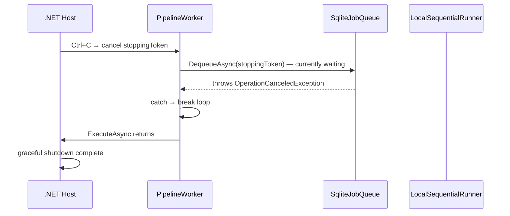

# L003 — CancellationToken: the polite way to stop

> Lesson 003 | 2026-05-03 | Git: `a96b94c`
> Tracks: csharp
> Requires: L001, L002

---

## You open the file and see...

`src/PiKoRe.Core/Abstractions/IJobRunner.cs` @ `a96b94c`

```csharp
public interface IJobRunner
{
    Task<JobResult> RunAsync(Job job, CancellationToken ct);
}
```

`src/PiKoRe.Core/Abstractions/IJobQueue.cs` @ `a96b94c`

```csharp
public interface IJobQueue
{
    Task EnqueueAsync(Job job, CancellationToken ct);
    Task<Job?> DequeueAsync(CancellationToken ct);
    Task MarkCompletedAsync(Guid jobId, CancellationToken ct);
    // ...
}
```

Every single method ends with `CancellationToken ct`. Without exception.

You probably know `Task` and `async/await`. But what is `CancellationToken`, and why is it on every method in the codebase?

---

## First instinct: the naive approach

If you didn't know about `CancellationToken`, you'd write methods without it:

```csharp
// naive — problems below
public interface IJobRunner
{
    Task<JobResult> RunAsync(Job job);
}
```

This compiles. It works while the app is running normally. The problem appears the moment you want to stop the app.

---

## What breaks

The `PipelineWorker` runs forever — it loops, polls the queue, and runs jobs until the process exits. When you press Ctrl+C or the host shuts down, .NET needs to stop this loop cleanly. "Cleanly" means:

- No job left half-run
- No database connection left open with an uncommitted transaction
- No thread stuck waiting for a lock it will never get

Without `CancellationToken`, .NET has two options: wait forever, or kill the process. Neither is good.

Specifically, here's what gets stuck:

**SqliteConnection.OpenAsync** — opening a connection can block waiting for a lock. If there's no cancellation token, this will wait forever after shutdown is requested.

**SemaphoreSlim.WaitAsync** — `LocalSequentialRunner` uses a semaphore to limit how many jobs run at once. If the semaphore is full and shutdown is requested, the worker would wait for a slot that will never be freed.

**Task.Delay** — `PipelineWorker` sleeps 100ms between polls when the queue is empty. Without a cancellation token, this sleep continues past the shutdown signal, adding unnecessary delay to every stop.

---

## What the repo actually does (and why)

`PipelineWorker` receives a cancellation token from .NET's `BackgroundService` infrastructure. It checks it on every loop iteration and passes it to every method it calls:

`src/PiKoRe.Core/Pipeline/PipelineWorker.cs` @ `a96b94c`

```csharp
protected override async Task ExecuteAsync(CancellationToken stoppingToken)
{
    while (!stoppingToken.IsCancellationRequested)   // ← check before each iteration
    {
        Job? job;
        try
        {
            job = await _jobQueue.DequeueAsync(stoppingToken);  // ← pass it along
        }
        catch (OperationCanceledException)
        {
            break;  // ← clean exit when cancelled mid-dequeue
        }

        if (job is null)
        {
            await Task.Delay(100, stoppingToken).ConfigureAwait(false);  // ← cancellable sleep
            continue;
        }

        var result = await _runner.RunAsync(job, stoppingToken);  // ← pass it along
        // ...
    }
}
```

The token flows downward. `DequeueAsync` passes it to `conn.OpenAsync(ct)`. The semaphore uses it in `WaitAsync(ct)`. Every blocking call gets the same signal.

Here's the shutdown sequence:



When `.IsCancellationRequested` becomes `true`, any `await` that received the token will either return early or throw `OperationCanceledException`. The caller decides whether to catch it or let it propagate.

The `.NET` runtime gives `BackgroundService` implementations a grace period (default: 5 seconds). After that it forces termination. With proper cancellation, the worker stops in milliseconds.

---

## The general idea

`CancellationToken` is .NET's cooperative cancellation mechanism. One end of the system signals a `CancellationTokenSource`; the token derived from it propagates the signal to every operation that received it.

"Cooperative" means nothing is forcibly killed — every operation that received the token checks it voluntarily. This is how you get clean shutdown: each layer has the chance to commit or rollback, release locks, and return gracefully.

The rule for async methods: if your method does any I/O (database, HTTP, file, sleep), it should accept a `CancellationToken` and pass it to every async call inside it. The only time you omit it is for trivial synchronous computation.

---

## Another place you'll see this

`LocalSequentialRunner.RunAsync` passes the token to `_cpuSlots.WaitAsync(ct)`, `plugin.AnalyzeAsync(request, token)`, and `_publisher.Publish(..., ct)`. Every call that could block gets the token. If the process is asked to stop while waiting for a CPU slot, it doesn't hang — it cancels the wait and returns.

When you implement a new plugin (Phase 6+), its `AnalyzeAsync(AnalysisRequest request, CancellationToken ct)` method must also pass `ct` to any I/O it does — HTTP calls to Ollama, file reads, database writes.

---

## Try it

1. In `src/PiKoRe.Data/SqliteJobQueue.cs`, find the private `OpenAsync` method. Trace what happens to the `CancellationToken` it receives — where does it go from there?

2. `PipelineWorker` catches `OperationCanceledException` specifically. What would happen if it *didn't* catch it? Would the app still shut down cleanly? (Hint: `BackgroundService` has its own handling — look at what `ExecuteAsync` returning normally vs throwing means.)

3. In `LocalSequentialRunner`, the retry pipeline calls `plugin.AnalyzeAsync(request, token)`. The variable is named `token`, not `ct`. Why is it a different variable name? Are they the same token?
