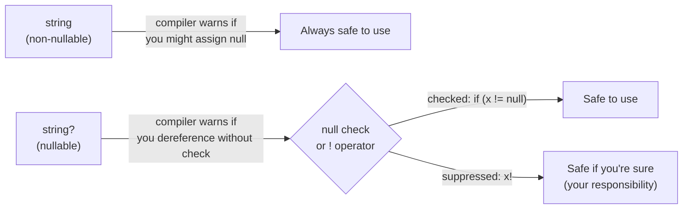

# L004 — Nullable types: making "no value" explicit

> Lesson 004 | 2026-05-03 | Git: `a96b94c`
> Tracks: csharp
> Requires: L002

---

## You open the file and see...

`src/PiKoRe.Core/Models/Job.cs` @ `a96b94c`

```csharp
public sealed record Job(
    Guid Id,
    Guid FileId,
    string Capability,
    JobStatus Status,
    Guid? PluginId,
    int Priority,
    DateTimeOffset Created,
    DateTimeOffset Updated,
    string? Error,
    string? FilePath,
    string? MediaType
);
```

Some fields end with `?`. Some don't. `Capability` is `string`. `Error` is `string?`. `FileId` is `Guid`. `PluginId` is `Guid?`.

This is not accidental. The `?` is a design statement about whether that field is allowed to be missing.

---

## First instinct: the naive approach

Before C# 8, all reference types (strings, objects, interfaces) could be `null` without any annotation. The naive approach is to not think about it:

```csharp
// naive — problems below
public class Job
{
    public string Capability { get; set; }
    public string Error { get; set; }       // ← could be null at runtime
    public string FilePath { get; set; }    // ← could be null at runtime
}
```

A completed job has no error. A freshly-enqueued job has no `FilePath` yet (it gets populated during dequeue via a JOIN). In the naive version, both of those facts are invisible — everything is `string`, and you just have to know which ones might be null.

---

## What breaks

**Problem 1: invisible null.**

Somewhere deep in `LocalSequentialRunner`, the code does this:

```csharp
var request = new AnalysisRequest(job.Id, job.FileId, job.FilePath!, null);
```

Note the `!` operator — `job.FilePath!` tells the compiler "I know this isn't null, trust me." Without nullable annotations on the type, that `!` is invisible — you can't tell from the `Job` definition whether `FilePath` is guaranteed or not.

With `string? FilePath`, the compiler sees the question mark and warns you every time you dereference it without a null check. The `!` in production code is now an explicit, visible decision: "this can't be null at this point, here's why."

**Problem 2: NullReferenceException at runtime.**

The classic .NET exception. In a pipeline that processes thousands of files, a single `NullReferenceException` on a non-nullable string that was somehow null will crash a job with a generic error and no indication of which field was null or why.

With nullable annotations and warnings-as-errors (or just treating compiler warnings seriously), you catch the category of bugs at compile time, not at 3am when the pipeline is stuck.

---

## What the repo actually does (and why)

The `Job` record uses `?` precisely where a field has no value in some states:

| Field | Type | Why |
|-------|------|-----|
| `Capability` | `string` | Always present — a job without a capability is meaningless |
| `PluginId` | `Guid?` | May not be assigned to a specific plugin yet |
| `Error` | `string?` | Only present on failed jobs |
| `FilePath` | `string?` | Populated via JOIN at dequeue time; null before that |
| `MediaType` | `string?` | Same — populated at dequeue time |

The non-nullable fields (`Capability`, `FileId`, `Id`) are guaranteed by the database schema and the code that creates `Job` records. If one of them were missing, the app wouldn't have gotten as far as creating a `Job` object.

The same discipline appears at the interface level. `IMediaStore` returns a nullable result:

`src/PiKoRe.Core/Abstractions/IMediaStore.cs` @ `a96b94c`

```csharp
Task<FileAnalysisDetails?> GetFileDetailsAsync(Guid fileId, CancellationToken ct);
```

The `?` on the return type says: this method might return null. A file in the index might have no analysis data yet — it's been scanned but no plugin has run. The caller must check for null before using the result.

Compare with `DequeueAsync`:

```csharp
Task<Job?> DequeueAsync(CancellationToken ct);
```

The queue might be empty. Returning `null` is the clean way to say "nothing to dequeue" without throwing an exception. The `PipelineWorker` checks for null and sleeps 100ms if the queue was empty.

---

## How to read nullable annotations at a glance

```
string    — not null, always has a value, compiler enforces it
string?   — might be null, caller must check before using
Guid      — never null (Guid is a struct — structs can't be null)
Guid?     — "nullable struct" — either a Guid value or nothing
T?        — might be null (reference type) or might be default (value type)
```

Value types (`int`, `Guid`, `bool`, `DateTimeOffset`) can't be null at all in C# — they always have a value. Adding `?` to a value type creates a `Nullable<T>` wrapper that can hold either the value or "nothing."

Reference types (`string`, interfaces, classes) can be null by default in older C#, but with nullable reference types enabled (which this project has enabled), the compiler treats `string` as "never null" and `string?` as "might be null."



---

## The general idea

**Nullable reference types** (C# 8+) let the compiler track which variables can be null and which cannot. When the feature is enabled, `string` means "definitely not null" and `string?` means "might be null."

The benefit is that the distinction is encoded in the type signature — not in comments, not in documentation, not in your memory. A future reader (or you, six months from now) can see exactly which fields are always present and which ones need checking, just by reading the type.

---

## Another place you'll see this

`IJobQueue.DequeueAsync` returns `Job?` — the null case means "queue is empty." `IJobQueue.GetPipelineConfigDagJsonAsync` returns `string?` — null means no pipeline config has been saved yet. Every public API that might legitimately return nothing uses a nullable return type instead of throwing an exception.

As you read deeper into the codebase, watch for the `!` operator. Each use is a place where the programmer made a judgement call: "I know this can't be null here." Those are the places to read carefully.

---

## Try it

1. In `src/PiKoRe.Core/Models/Job.cs`, `FilePath` is `string?`. In `src/PiKoRe.Data/SqliteJobQueue.cs`, the `JobRow` private record at the bottom has `FilePath` as `string` (non-nullable). Why are they different? What guarantees the non-null in `JobRow`?

2. In `LocalSequentialRunner.RunAsync`, find the line `job.FilePath!`. Why is the `!` operator justified here — what code path ensures that `FilePath` is definitely not null by the time this line runs?

3. `IMediaStore.SearchByEmbeddingAsync` returns `IReadOnlyList<Guid>`, not `IReadOnlyList<Guid>?`. If no results are found, what does the method return? (Hint: compare with `DequeueAsync` returning `null` vs an empty list — which is more convenient for the caller?)
